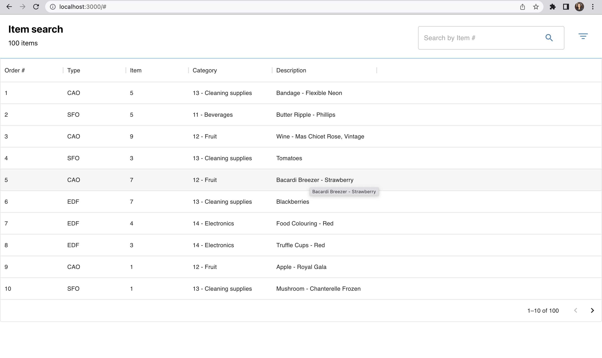
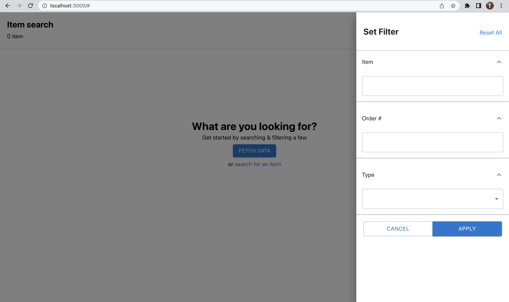
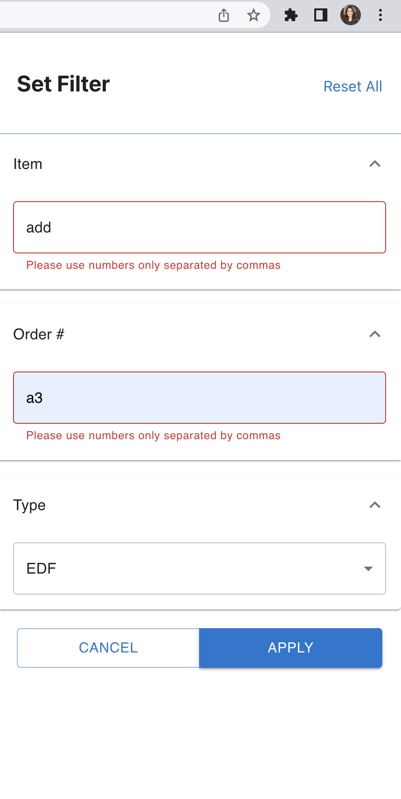
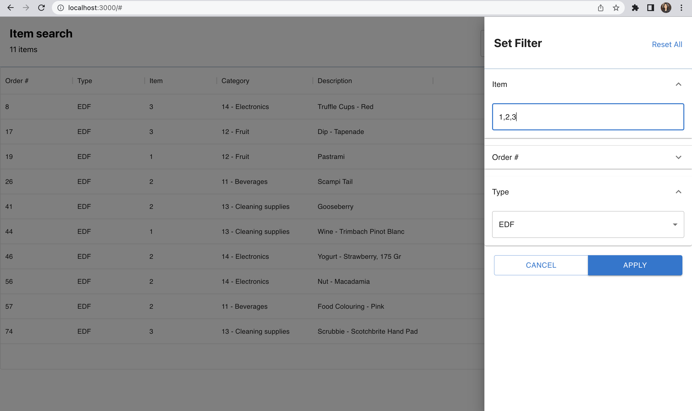
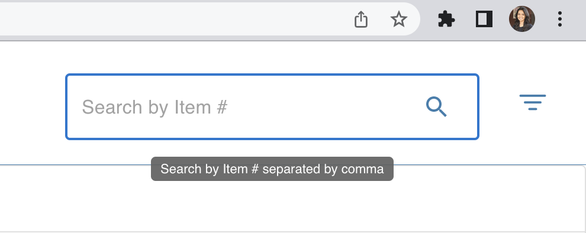
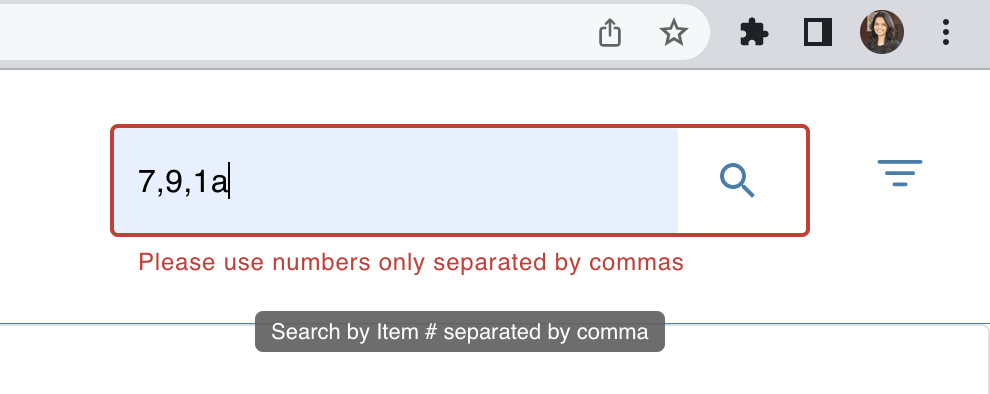

# Walmart-Spa

<table>
<tr>
<td>

   SPA that allows users to search orders in the system. 

</td>
</tr>
</table>

## Instructions

+ Git clone this repository
 + Open the folder - walmart-spa
 + npm install
 + npm start
 
## Screenshots

    

 

    

    

    

    

 

    

    

